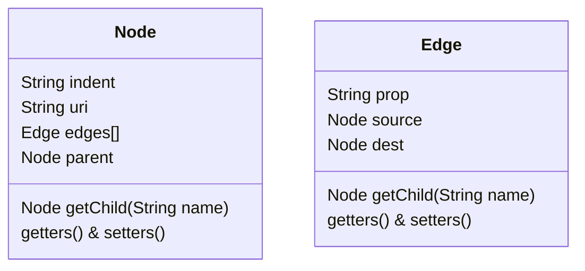

```mermaid
classDiagram
    class Node {
        String indent
        String uri
        Edge edges[]
        Node parent

        Node getChild(String name)
        getters() & setters()
    }

    class Edge {
        String prop
        Node source
        Node dest

        Node getChild(String name)
        getters() & setters() 
    }
```